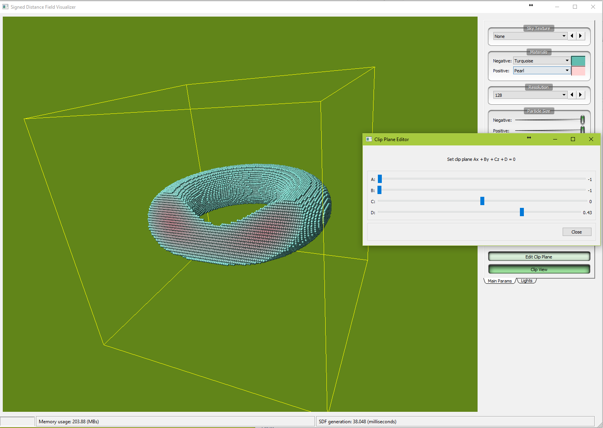

# Simple Signed Distance Field Visualizer

* The program is implemented in Qt 5.9 framework. Its is for my personal testing of signed distance field implementation.
* Multi-threading by Intel TBB libary.
* Show real-time memory usage and SDF generation time.
* Particles are grouped into two parts: one with particles at negative distance values to object surface (inside), and one with particles at positve distance values (outside).
* Particles' colors fall off as the absolute distance increasing.
* Support clipped-plane to look inside the object.
* Skybox textures in folder Textures/Sky are automatically loaded at start up.
* Press 'R' key to reset camera view.
<!---  A Prebuild has been provided to run immediately. --->
* As my implementation depends on a lots of external libaries, the source code can only be compiled by me.

---

# Screenshots:

---

# References

* [http://iquilezles.org/www/articles/distfunctions/distfunctions.htm](http://iquilezles.org/www/articles/distfunctions/distfunctions.htm)
* [https://github.com/christopherbatty/SDFGen](https://github.com/christopherbatty/SDFGen)
